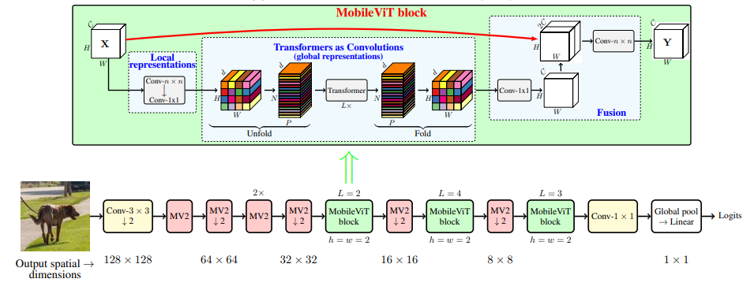
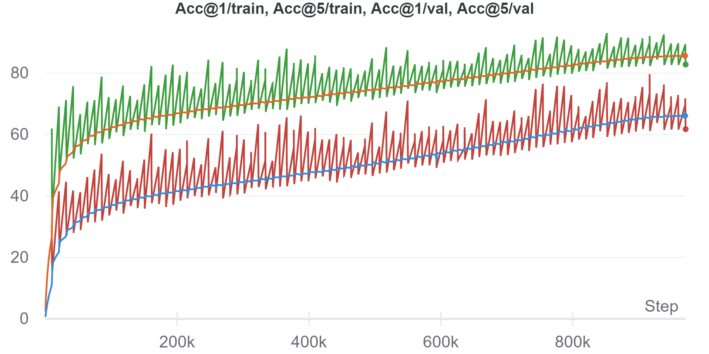
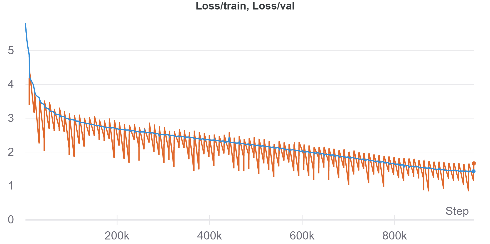

# MobileViT

Unofficial PyTorch implementation of MobileViT based on paper [MOBILEVIT: LIGHT-WEIGHT, GENERAL-PURPOSE, AND MOBILE-FRIENDLY VISION TRANSFORMER](https://arxiv.org/abs/2110.02178).

---

## Table of Contents
* [Model Architecture](#model-architecture)
* [Usage](#usage)
* [Experiment Result](#experiment)
* [Citation](#citation)


---
## Model Architecture
<figure>

<figcaption align = "center"><b>MobileViT Architecture</b></figcaption>
</figure>

---

## Usage

```bash=
import torch
import models

img = torch.randn(1, 3, 256, 256)
net = models.MobileViT_S()

# XXS: 1.3M 、 XS: 2.3M 、 S: 5.6M
print("MobileViT-S params: ", sum(p.numel() for p in net.parameters()))
print(f"Output shape: {net(img).shape}")
```

### Training
- Single node with one GPU
```bash=
python main.py
```

- Single node with multi GPU
```bash=
CUDA_VISIBLE_DEVICES=3,4 python -m torch.distributed.launch --nproc_per_node=2 --master_port=6666 main_ddp.py
```

```bash=
optional arguments:
  -h, --help            show this help message and exit
  --gpu_device GPU_DEVICE
                        Select specific GPU to run the model
  --batch-size N        Input batch size for training (default: 64)
  --epochs N            Number of epochs to train (default: 20)
  --num-class N         Number of classes to classify (default: 10)
  --lr LR               Learning rate (default: 0.01)
  --weight-decay WD     Weight decay (default: 1e-5)
  --model-path PATH     Path to save the model
```

---

## Experiment





### MobileVit-S Pretrained Weights: [weight](https://drive.google.com/file/d/1ZQt1vACHTN98QJYaT2JW3kPF-wziHyPX/view?usp=sharing)
### MobileVit-XXS Pretrained Weights: [weight](https://drive.google.com/file/d/1PZGq1hVNokS1r5R3cCJr9IC75CyjL6a8/view?usp=sharing)

### How to load pretrained weight(training with DataParrael)
Solution by the **[@Sehaba95](https://github.com/wilile26811249/MobileViT/issues/7)**:
```python=
def load_mobilevit_weights(model_path):
  # Create an instance of the MobileViT model
  net = MobileViT_S()

  # Load the PyTorch state_dict
  state_dict = torch.load(model_path, map_location=torch.device('cpu'))['state_dict']

  # Since there is a problem in the names of layers, we will change the keys to meet the MobileViT model architecture
  for key in list(state_dict.keys()):
    state_dict[key.replace('module.', '')] = state_dict.pop(key)

  # Once the keys are fixed, we can modify the parameters of MobileViT
  net.load_state_dict(state_dict)

  return net

net = load_mobilevit_weights("MobileViT_S_model_best.pth.tar")
```

---

|Model  |  Dataset | Learning Rate |   LR Scheduler | Optimizer |  Weight decay |   Acc@1/Val  |  Acc@5/Val  |
|-------|:--------:|:------:|:----:|:--------:|:-------:|:--------:|:-------:|
|MobileViT |  ImageNet-1k |  0.05  | Cosine LR|  SGDM   |  1e-5   |  61.918%  |  83.05% |

---

## Citation
```
@InProceedings{Sachin2021,
  title = {MOBILEVIT: LIGHT-WEIGHT, GENERAL-PURPOSE, AND MOBILE-FRIENDLY VISION TRANSFORMER},
  author = {Sachin Mehta and Mohammad Rastegari},
  booktitle = {},
  year = {2021}
}
```


### If this implement have any problem please let me know, thank you.
